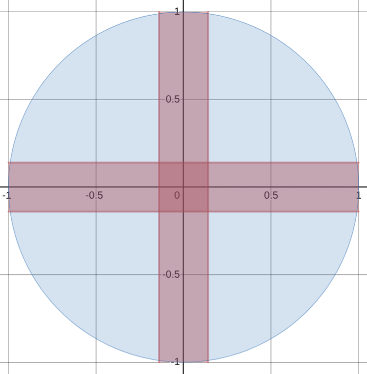
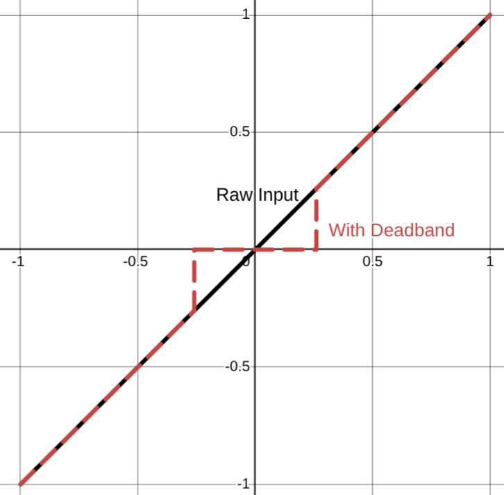
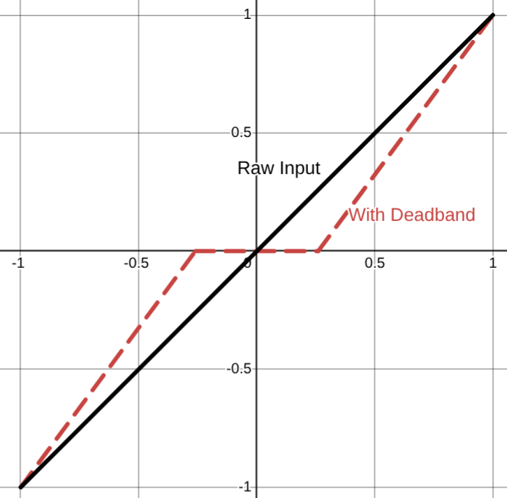
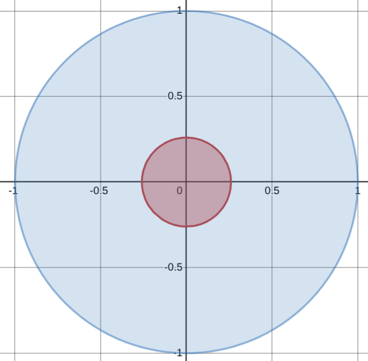

# Improving Joystick Control and Precision

Joysticks are a highly effective tool to produce analog inputs. They are
incredibly common, finding their way into fighter jet cockpits, video games,
and certain notorious deep sea expeditions (the Titan submersible). Their
intuitive design make them easy to use and a good choice for many systems.

However, raw inputs from a joystick are noisy and imprecise and are rarely used
directly in practice. This article will cover some techniques to improve the 
level of precision when using joysticks.

## Deadbands

Joystick drift refers to the small error in measurement that tends to occur
after considerable use of a controller. Drift is present in all controllers
after enough use, but is notorious for happening quickly with Nintendo Joycons.
A similar error in measurement can appear to occur just by the user holding the
joystick slightly off center. Even smaller errors could be created by <abbr
title="Electromagnetic Interference">EMI</abbr> from the surrounding
environment.

The resulting behavior in video games usually looks like the character has a
mind of its own and moves without you touching the controller. When driving a
robot or car, it would constantly pull toward the side that the controller
drifts.

Clearly, this is an undesirable behavior and should be mitigated.

The real challenge is differentiating what is joystick drift and what is human
input, then ignoring the appropriate inputs. When using a deadband, the
underlying assumption is that user input will never be a small value because
any significant action that a user wants to take should require significant
changes to the input. 

### Square Dead Bands

Joystick inputs come in a pair from two encoders in the joystick representing
the X and Y axis of the stick. Assume the values are between -1 and 1
representing the joystick being pushed fully in one direction or the other. The
simplest solution is to cut away the small values centered around zero. This is
easily implemented with an if statement that checks if the absolute value of
the input is below a threshold (the deadband).

$$
\text{Let } d \text{ be the value for the deadband.} \\
\text{Then the resulting function representing the deadband is} \\
f(x) = 
\begin{cases} 
0 & \text{if } |x| \leq d \\
x & \text{if } |x| > d \\
\end{cases}
$$

<details class="code">
    <summary> Java </summary>

```java
import java.lang.Math;

public float applyDeadBand(float x) {
    float DEAD_BAND = 0.05;

    if (Math.abs(x) < DEAD_BAND) {
        return 0.0;
    } else {
        return x;
    }
}
```
</details>
<details class="code">
    <summary> Python </summary>

```python
def apply_deadband(x: float) -> float:
    DEAD_BAND = 0.05

    if abs(x) < DEAD_BAND:
        return 0.0
    else:
        return x
```
</details>

Graphing a deadband to both the X and Y axis is how it gets the name "square
deadband". The areas in blue are valid points in the input space (where the
joystick can be) and the red is areas that are within the deadband.



There is still an issue with this implementation. Now, all of the values within the
deadband are invalid outputs, always returned as zero. The user may still want to output
a small value and have a deadband to mitigate joystick drift.

Assume the x-axis is the input and the y-axis is the output. Plotting the
current implementation will result in the following:



As you can see, there is no way for the user to output values smaller than the
deadband. This is not optimal because the use cases for analog input, like a
joystick, usually require precision control. For example, in
racing games a large steering input is required at low speeds but at high
speeds small changes in steering dramatically change the car's trajectory.

A simple fix is to adjust the output to include the entire range [-1, 1] by
passing the input through a simple linear function. The slope is rise (0-1) over
run (1 - deadband) and deadband is subtracted/added to x so the x-intercept is
when the deadband ends. The resulting function is:

$$
f(x) = 
\begin{cases} 
\frac{1}{1 - d} (x + d) & \text{if } x > 0 \\
\frac{1}{1 - d} (x - d) & \text{if } x < 0 
\end{cases}
$$

<details class="code">
    <summary> Java </summary>

```java
import java.lang.Math;

public float applyDeadBand(float x) {
    float DEAD_BAND = 0.05;

    if (Math.abs(x) < DEAD_BAND) {
        return 0.0;
    } else if (x < 0) {
        return 1.0 / (1.0 - DEAD_BAND) * (x + DEAD_BAND);
    } else {
        return 1.0 / (1.0 - DEAD_BAND) * (x - DEAD_BAND);
    }
}
```
</details>
<details class="code">
    <summary> Python </summary>

```python
def apply_deadband(x: float) -> float:
    DEAD_BAND = 0.05

    if abs(x) < DEAD_BAND:
        return 0.0
    elif x < 0:
        return 1.0 / (1.0 - DEAD_BAND) * (x + DEAD_BAND);
    else:
        return 1.0 / (1.0 - DEAD_BAND) * (x - DEAD_BAND);
```
</details>

This makes the deadband function onto (it maps to every possible output) which
means that users can now produce small values after moving past the deadband.

Plotting the implementation you can see the function doesn't have any vertical
sections where outputs are skipped.



### Circular Deadbands (Polar Coordinates)

You may notice an issue with the square deadband implementation. In the
diagonal directions the deadband removes more than in the cardinal directions.
This means that the same magnitude of the input (how much the joystick is
pushed down) will be clamped to zero depending on the direction it is pointing. 

To make the deadband apply evenly no matter which direction the joystick is in,
circular deadbands are used. Take the X and Y inputs from the joystick and convert
them into a vector. Then, apply the deadband function from above which preserves
the entire range of outputs to the magnitude of the vector. Finally, use the angle
to get back to X and Y coordinates.

$$
\text{Let } \|v\| = \sqrt{x_{in}^2 + y_{in}^2} \\
\text{Let } \theta = \arctan(\frac{y_{in}}{x_{in}}) \\
\\
f(x) = 
\begin{cases} 
\frac{1}{1 - d} (x + d) & \text{if } x > 0 \\
\frac{1}{1 - d} (x - d) & \text{if } x < 0
\end{cases} \\
\\
\text{Let } x_{out} = f(\|v\|) \cdot \cos(\theta) \\
\text{Let } y_{out} = f(\|v\|) \cdot \sin(\theta) \\
$$

<details class="code">
    <summary> Java </summary>

```java
public double[] applyDeadBand(double xIn, double yIn) {
    float DEAD_BAND = 0.05;

    double magnitude = Math.hypot(xIn, yIn);
    double theta = Math.atan2(yIn, xIn);
    
    if (Math.abs(x) < DEAD_BAND) {
        magnitude = 0.0;
    } else if (x < 0) {
        magnitude = 1.0 / (1.0 - DEAD_BAND) * (x + DEAD_BAND);
    } else {
        magnitude = 1.0 / (1.0 - DEAD_BAND) * (x - DEAD_BAND);
    }
    
    double xOut = magnitude * Math.cos(theta);
    double yOut = magnitude * Math.sin(theta);
    
    return new double[]{xOut, yOut};
}
```
</details>
<details class="code">
    <summary> Python </summary>

```python
import math

def apply_deadband(x_in, y_in):
    DEAD_BAND = 0.05

    magnitude = math.sqrt(x_in**2 + y_in**2)
    theta = math.atan2(y_in, x_in)

    if abs(magnitude) < DEAD_BAND:
        magnitude = 0.0
    elif x < 0:
        magnitude = 1.0 / (1.0 - DEAD_BAND) * (x + DEAD_BAND);
    else:
        magnitude = 1.0 / (1.0 - DEAD_BAND) * (x - DEAD_BAND);
        
    # Calculate output components
    x_out = magnitude * math.cos(theta)
    y_out = magnitude * math.sin(theta)
    
    return x_out, y_out
```
</details>


Plotting the deadband of the function above results in:



## Joystick Mapping

I mentioned in the previous section how when driving at high speeds, only small
inputs are required to have large changes in the direction of the car. This is
a common problem. Most of the time, the user only needs a small range of
outputs and anything else is either insignificant, or too large. Take driving a
car, 0-20mph is usually too slow to be of any significance, 20-70mph is where
most of your travel will be spent, and 70+mph happens on highways which only
need small adjustments in steering.

When using a linear function, including the deadband function we defined above,
too little of the input space maps to a useful part of the output space. There
needs to be a way to make the majority of inputs result in the majority of
useful outputs.

The solution is to apply an activation function to the input of the joystick.
The main idea is that we want to add some kind of non-linearity into this
system. The fun part is that you can decide how. Instead the simple linear
function we implemented early, you can use any function you want after the
deadband.

Picking an activation function depends entirely on the system you are trying to
control. Some common activation functions I've seen used are:

 - Quadratic $x^2$
 - Cubic $x^3$
 - Quartic $x^4$
 - Tanh $\tanh(x)$
 - Exponential $2^x - 1$
 - Piece-wise Linear Functions

and many more with variations on what constants are used, combining multiple
functions together, and higher order polynomials.

Many of these functions have the same goal. Make more of the input map to
smaller values in the output. They should all go from -1 to 1 (some need to be
piece-wise with one positive and one negative i.e. even degree polynomials).
The reasoning behind this is that precise control is easiest at lower speeds,
so more of the input space should map to the lower speeds giving greater
precision. However, the fast speeds are also needed some times, so near the end
of the input space the function ramps up quickly to end at 100%.

Most also have the bonus quality of having a built in deadband in which small
input values are made smaller.

My personal experience comes from being the driver/programmer for my high
school's robotics team. During this time, I used Desmos to regress three
fifth-order polynomials to fit a cubic bezier curve to create my activation
function. This function allocated most of the joystick's output to less than
half the top speed of the robot, but could still reach top speed if needed. It
ended up being:

$$
f(x) = 
\begin{cases} 
P(x) & \text{if } 0 \leq x \leq 1 \\
-P(|x|) & \text{if } -1 \leq x < 0 \\
\end{cases} \\
\\
\text{where } P(x) = 
\begin{cases} 
0.452515x^5 - 0.619042x^4 + 0.332171x^3 - 0.111379x^2 + 0.585934x - 0.0000825 &
0 < x \leq 0.759808 \\ 1402.36289x^5 - 5750.3564x^4 + 9436.1622x^3 -
7743.9163x^2 + 3178.27035x - 521.5418 & 0.759808 < x \leq 0.935956 \\
133388.9857x^5 - 658439.6582x^4 + 1298943.527x^3 - 1280124.655x^2 +
630239.1878x - 124006.3873 & 0.935956 < x \leq 1 
\end{cases}
$$

<details class="code">
    <summary> Java </summary>

```java
public float mappingFunction(float x) {
    
    if(x > 0) {
      if(x <= 0.759808) {
        return
          0.452515 * Math.pow(x, 5) +
          -0.619042 * Math.pow(x, 4) +
          0.332171 * Math.pow(x, 3) +
          -0.111379 * Math.pow(x, 2) +
          0.585934 * x + 
          -0.0000825337;
      } else if(x <= 0.935956) {
        return
          1402.36289 * Math.pow(x, 5) +
          -5750.3564 * Math.pow(x, 4) +
          9436.1622 * Math.pow(x, 3) +
          -7743.9163 * Math.pow(x, 2) +
          3178.27035 * x + 
          -521.5418;
      } else if(x <= 1) {
        return
          133388.9857 * Math.pow(x, 5) +
          -658439.6582 * Math.pow(x, 4) +
          1298943.527 * Math.pow(x, 3) +
          -1280124.655 * Math.pow(x, 2) +
          630239.1878 * x + 
          -124006.3873;
      } else {
        return 0;
      }
    } else {
      x = Math.abs(x);

      if(x <= 0.759808) {
        return -1 * (
          0.452515 * Math.pow(x, 5) +
          -0.619042 * Math.pow(x, 4) +
          0.332171 * Math.pow(x, 3) +
          -0.111379 * Math.pow(x, 2) +
          0.585934 * x + 
          -0.0000825337);
      } else if(x <= 0.935956) {
        return -1 * (
          1402.36289 * Math.pow(x, 5) +
          -5750.3564 * Math.pow(x, 4) +
          9436.1622 * Math.pow(x, 3) +
          -7743.9163 * Math.pow(x, 2) +
          3178.27035 * x + 
          -521.5418);
      } else if(x <= 1) {
        return -1 * (
          133388.9857 * Math.pow(x, 5) +
          -658439.6582 * Math.pow(x, 4) +
          1298943.527 * Math.pow(x, 3) +
          -1280124.655 * Math.pow(x, 2) +
          630239.1878 * x + 
          -124006.3873);
      } else {
        return 0;
      }
    }
```

</details>

.](activation_function.png)

In retrospect, it would have been much more effective to approximate this
function using two or three linear functions. It would have been simpler to
understand the easier to compute. I got carried away with what I could do and
never stopped to ask if I should do it.

Learn from my mistakes, a simple polynomial function usually does the job just
fine.

## Next Steps

The world is a noisy place. Human inputs can be very noisy and erratic.
Additionally, the system being controlled may be affected by noise from the
environment. In either scenario, to resulting behavior will look like jittery
outputs and vibration.

Generally speaking, these jittery erratic movements will degrade mechanical
parts faster. If the system is controlled with motors, this will also shorten
the lifespan of the motors.

Adding a controller to the system will help remove noise from the system.
Similar to picking a joystick mapping function, picking the correct controller
depends on the specific system you are using. Some common techniques are:

- Feed-foward 
- Feed-back
- Trapezoidal motion profiles
- PID controllers

Of course, the best solution is to automate as much as you can. Machines are
precise, humans are not. Either way, you are now much better equipped to handle
analog user inputs with a high level of precision.

