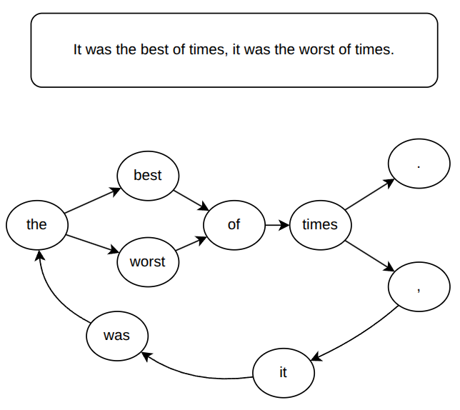
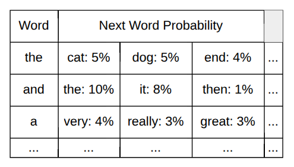
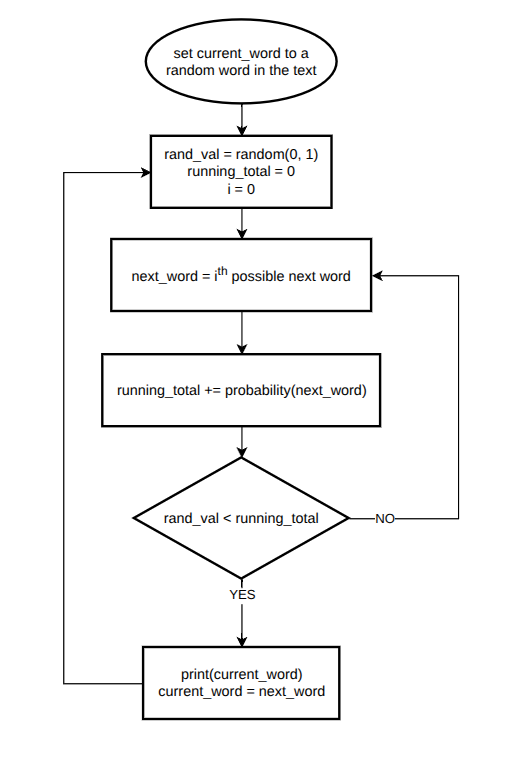
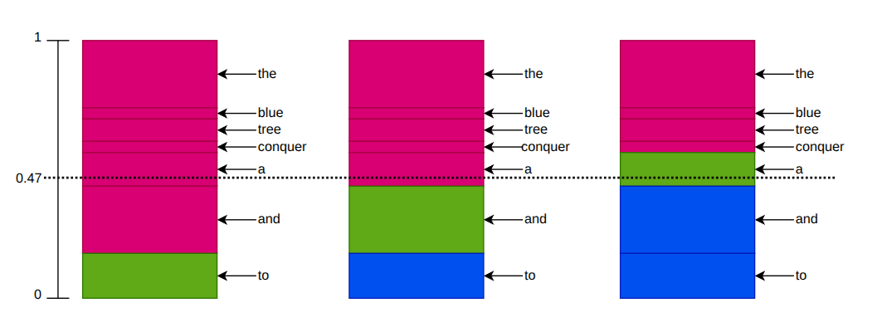

# Generating Random Text With Markov Chains

**The code is available to view and play with on [Github](https://github.com/mineable3/markov_chain_predictions).** I will have
some code snippets, but not the program as a whole.

**The goal:** Generate large amounts of text written in the same style as the
source material.

## The Algorithm

The algorithm consists of two parts, preprocessing of the training text and
random generation of new text. The first part establishes the probability
distribution and Markov chain and the second part, generating the text, is what
matters for optimization because after taking the limit where the number of
words to generate goes to infinity the first part goes to zero with how much
it contributes to run time.

### Preprocessing

To start, we need to parse the training text word by word. On each word, we
will increment the count for the number of times the next word has appeared
after the current word.

Example given:

> It was the best of times, it was the worst of times.

Starting on the word `It` we would record that `was` followed `It` once. Then
we would move to the next word. On `was` we would record `the` as following 
`was` once. We would continue on until the second occurrence of `it` where we
now record that `was` followed `it` twice. Then, `the` followed `was` twice.
However, when we reach the second occurrence of `the` we now record that `best`
has followed once *and* `worst` has followed once.

```python
data = list()

# gets a list with all the words in the training text in order
with open("moby_dick.txt", 'r') as raw_text:
    data = raw_text.read().split()

frequency_table = dict()

for i, word in enumerate(data):
    # The last word of the data
    if i >= len(data) - 1:
        frequency_table[word] = {"EOF": 1}
        break

    # Ensures a dictionary exists for each word we see
    if word not in frequency_table:
        frequency_table[word] = dict()

    next_word = data[i+1]

    if next_word in frequency_table[word]:
        # Both the current and next word have been seen before
        frequency_table[word][next_word] += 1
    else:
        # The next word is new
        frequency_table[word][next_word] = 1
```

Continuing on through the whole text will leave us with a list of words and
frequencies of the words that followed it. To turn the frequencies into
probabilities, simply divide each frequency by the number of times the current
word has appeared. Arranging words as states and the edge weights according to
the probability of following the current word. We can represent the training
text as a Markov chain.



The Markov chain can be represented by a lookup table of probabilities given
the current state or word. In Python, I used a dictionary of dictionaries.

```python
totals = dict()

# Counting totals
for word, tallies in frequency_table.items():
    totals[word] = 0
    for count in tallies.values():
        totals[word] += count

# Calculating probabilities
for word, tallies in frequency_table.items():
    for next_word, count in tallies.items():
        frequency_table[word][next_word] = count / totals[word]

probabilities = frequency_table
```



### Generating Text

The Markov chain that we have created stores the statistical distribution of
words in our training text. Randomly walking through the Markov chain will
produce random text that has the same distribution of words as the training
text and as a result will roughly sound like it.

We will use a technique called *rejection sampling* to generate text. Start by
picking a random word.

1. Lookup the possible words that can follow the current word and their
   associated probabilities.
2. Generate a random value from 0 to 1.
3. Start a running total at 0.
4. Take a possible next word for the current word and add its probability to
   the running total.
5. If the random value is less than the running total, add the current option
   of next word to the output text and set it to be the current word.
6. If the random value is NOT less than the running total, go back to step 4.



```python
# The number of words to generate
n = 100000 

all_words = list(probabilities.keys())
word = all_words[int(random.random() * len(all_words))]

for _ in range(n):
    val = random.random()
    running_total = 0
    i = 0

    # If the random value is less than the threshold
    # for a word, keep that word.
    while val >= running_total:
        next_word = list(probabilities[word])[i]

        if next_word == "EOF":
            next_word = data[0]

        running_total += list(probabilities[word].values())[i]
        i += 1

    #print(next_word, end=' ')
    print(next_word, end=' ', flush=True)

    word = next_word
```

When I first learned about this algorithm, it raised a lot of questions. I
couldn't understand how it was able to sample based on the distribution we
wanted. To better explain it, I made the diagram below. The diagram shows three
iterations through the algorithm with some example words probabilities. The
random value is 0.47. The red sections are where the current choice of possible
next word will be rejected, the green section is where it will be accepted, and
the blue sections are almost another rejection because the algorithm would have
already ended.



**NOTE:** The program we have written so far recognizes words with punctuation
or capitalization as unique words. In the optimized version on Github,
I separate words from their punctuation, but never deal with capitalization.

## Optimization

I timed how long it took to generate 100,000 words with *Moby Dick* as the
training text. The times are going to vary depending on your hardware and
implementation of the algorithm, but they should give you an idea of why
optimization is needed here.

Before optimization:

```bash
$ time python main.py

18 minutes
```

After optimization:

```bash
$ time python main.py

5 seconds
```

**NOTE:** These optimizations are for time efficiency, not space efficiency.
For example, memoization makes the program run much faster, but takes up more
memory to store previous calculations. I'm not sure how Numpy affects space
efficiency, but it does make it much faster.

### Numpy

Python is a slow language, a cheap way to make your program run faster without
having to do any algorithmic optimization is to not run Python code. Numpy is
written in C which makes it much faster. I switched all the native Python lists
to Numpy arrays and built-in methods.

For example, at the start of the algorithm to pick the first word:

```python
all_words = np.array(list(probabilities.keys()))
word = all_words[int(rng.random() * all_words.size)]
```

### rng.choice Instead of Rejection Sampling

Sampling from a discrete probability distribution is a very common problem, so
the good folks at Numpy wrote a method to do that into their rng class. This
replaces a loop may iterate through all the possible next words with a single
method call. 

```python
next_word = rng.choice(possible_next_words[word], p=next_word_probabilities[word])
```

### Memoization

Inside the text generation loop, the list of possible next words and list of 
probabilities gets regenerated for every iteration. Instead of regenerating 
those lists every loop, the program generates them once for the current word
and stores them for later. When it lands on a word it's already seen, it can
just reference the lists instead of make new ones.

## Conclusion

This was a really fun algorithm to write and the text it generates is great to
play around with. The text it generates feels almost right, but never quite
makes any sense. It's like the uncanny valley of text because the program only
generates words that it has seen follow the current word, each word will always
logically follow the one before it. As you read, word by word, it makes sense
to see each word follow the current one, but as your brain tries to piece
together the meaning it just can't. It's frustratingly close to making sense,
but it never does.

While building this project I showed a piece of text my program had generated
to a coworker of mine. I told him it was an excerpt from *Moby Dick* and asked
him to describe what was happening. He sat there struggling to understand it
for 20 minutes before I felt bad enough to let him know what he was reading.
Using older writing like *Moby Dick* (or *The Complete Works of Shakespeare*)
makes it even harder to recognize that the words are meaningless because the
source material is already so hard for modern English speakers to read. 

I hope you had as much fun building this algorithm as I did!

